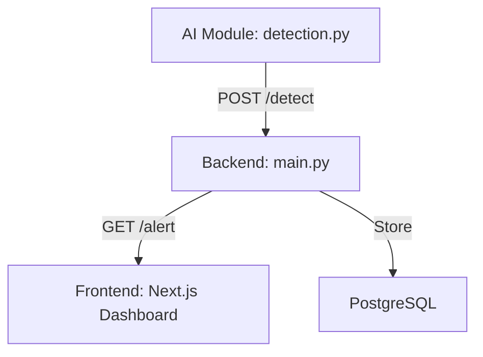

# 🧠 AI-Based RailGuard System

A real-time obstacle detection and alert system for locomotive pilots. 

## 🏗️ Project Architecture



### 📁 Directory Structure
- **[/frontend](file:///d:/project%20from%20D/Train%20Obstacle%20Detection/frontend)**: Next.js dashboard with live visual alerts and audio beeps. (Member 1)
- **[/backend](file:///d:/project%20from%20D/Train%20Obstacle%20Detection/backend)**: FastAPI server handling signals, storage, and alert logic. (Member 2)
- **[/ai](file:///d:/project%20from%20D/Train%20Obstacle%20Detection/ai)**: YOLOv8-based vision model for track scanning. (Member 3)

---

## 🧑‍🤝‍🧑 Integration Guide for Members

### Member 2 (Backend)
- Drop your FastAPI code into the `backend/` directory.
- Ensure the API matches the frontend contract.
- Default endpoint: `http://localhost:8000`.

### Member 3 (AI)
- Place your YOLO models and processing scripts in the `ai/` directory.
- Send detection JSON to `POST /detect`.
- Example detection JSON:
  ```json
  {
    "object": "person", 
    "distance": 180, 
    "confidence": 0.95
  }
  ```

---

## 🚀 Running the Full Prototype

1. **Start Backend**: `cd backend; pip install fastapi uvicorn; uvicorn main:app --reload`
2. **Start Frontend**: `cd frontend; npm install; npm run dev`
3. **Start AI Scanner**: `cd ai; python detection.py`
